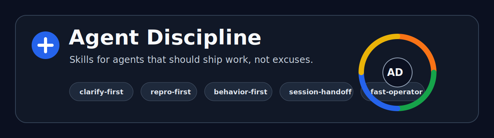

<p align="center">
  
</p>

<h1 align="center">Agent Discipline</h1>

<p align="center">
  Practical bilingual skills that make AI coding agents more disciplined, testable, and useful in real engineering work.
</p>

<p align="center">
  <b>让 AI 编程 Agent 不再只会“看起来很忙”，而是更会复现、更会验证、更会交付。</b>
</p>

<p align="center">
  <a href="./LICENSE"></a>
  
  
  
</p>

---

AI coding agents are powerful. Raw power is not discipline.

很多 AI 编程工具的问题不是“不会写代码”。问题更朴素，也更危险：

- 没问清楚就开工
- bug 没复现就开始猜
- 测试没跑就说完成
- 解释很多，推进很少
- 一遇到环境问题，就把用户变成命令执行员

**Agent Discipline** 是一组小而实用的 Agent skills。它给 AI Agent 装上工程纪律：先澄清、先复现、先测试、短交接、快执行。

不是让 Agent 更会表演，是让它更会干活。

## The Five Moves

```text
clarify before building
reproduce before fixing
test behavior before refactoring
handoff before context dies
act fast without turning the user into your assistant
```

中文更直接：

```text
先问清楚，再开工。
先复现，再修 bug。
先测行为，再谈重构。
先留交接，再换会话。
先自己干，别让用户替你打杂。
```

## Skills

| Skill | 一句话说明 | When to use |
|---|---|---|
| [`clarify-first`](./skills/clarify-first/SKILL.md) | 先把需求、术语、边界问清楚 | Before features, product ideas, architecture, PRDs |
| [`repro-first`](./skills/repro-first/SKILL.md) | 先建立复现闭环，再修 bug | Bugs, failures, flaky tests, slow paths |
| [`behavior-first`](./skills/behavior-first/SKILL.md) | 用行为测试和红绿重构交付功能 | Feature work, regression fixes, test-first changes |
| [`session-handoff`](./skills/session-handoff/SKILL.md) | 把上下文压缩成下一会话可接手文档 | Long sessions, handoffs, context resets |
| [`fast-operator`](./skills/fast-operator/SKILL.md) | 少废话，快执行，只在真实边界打断用户 | High-agency execution, ops, GitHub, environment work |

## Quick Install For Codex

Clone the repo, then run:

```powershell
.\scripts\install-codex.ps1
```

Or copy manually:

```powershell
Copy-Item .\skills\* "$env:USERPROFILE\.codex\skills" -Recurse -Force
```

Then restart Codex or open a new session.

More detail: [Installation Guide](./docs/installation.md)

## How To Call The Skills

English:

```text
Use $clarify-first before building this feature.
Use $repro-first to debug this failure.
Use $behavior-first to implement this with tests.
Use $session-handoff to prepare the next session.
Use $fast-operator from now on.
```

中文：

```text
先用 clarify-first 问清楚
用 repro-first 排查这个 bug
用 behavior-first 做这个功能
用 session-handoff 做交接
进入 fast-operator 模式
```

## Recommended Workflows

New feature:

```text
clarify-first -> behavior-first -> session-handoff
```

Bug:

```text
repro-first -> behavior-first -> session-handoff
```

Daily agent work:

```text
fast-operator always on
```

## Who This Is For

适合：

- 用 Codex、Claude Code、Cursor、Copilot Workspace 或其他 coding agent 做项目的人
- 想让 Agent 更像工程搭档，而不是“语气很礼貌的随机代码生成器”的人
- 自己不是传统程序员，但想靠 AI 把项目做得更稳的人
- 受够了“我已经完成了”，结果测试没跑、页面打不开、仓库没推上去的人

Not for:

- 想让 Agent 无脑生成一堆代码的人
- 不在乎测试、不在乎复现、不在乎交接的人
- 喜欢把用户变成终端操作员的 Agent

## Design Taste

Agent Discipline has a bias:

- **Evidence over vibes**
- **Behavior over implementation**
- **One useful question over ten lazy questions**
- **Verified work over confident narration**
- **Operator mindset over chatbot energy**

The agent should not sound like a legal department with a keyboard.

## Repository Structure

```text
agent-discipline/
├─ assets/
│  └─ agent-discipline-banner.svg
├─ skills/
│  ├─ clarify-first/
│  ├─ repro-first/
│  ├─ behavior-first/
│  ├─ session-handoff/
│  └─ fast-operator/
├─ docs/
│  ├─ installation.md
│  ├─ skill-guide.md
│  └─ philosophy.md
├─ scripts/
│  └─ install-codex.ps1
├─ .github/
│  └─ ISSUE_TEMPLATE/
├─ ROADMAP.md
├─ CONTRIBUTING.md
├─ SECURITY.md
├─ LICENSE
└─ README.md
```

## Project Status

Early, usable, opinionated.

The current version is intentionally small. Five skills, each with one job. No prompt landfill.

See [Roadmap](./ROADMAP.md) for planned improvements.

## Suggested GitHub Topics

```text
ai-agent
coding-agent
codex
agent-skills
software-engineering
tdd
debugging
bilingual
developer-tools
prompt-engineering
```

Full repository settings checklist: [GitHub Settings](./docs/github-settings.md)

## Credits

Inspired by the broader AI engineering skills movement and the idea that agents need workflows, not just prompts.

This repository uses its own names, wording, and operating style. Built for practical agent work in Chinese and English environments.

## License

MIT.
